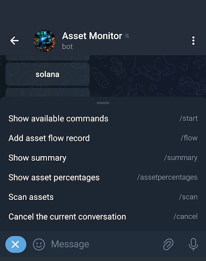
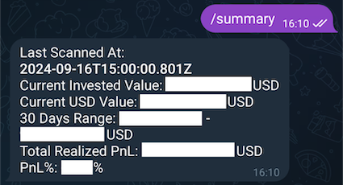
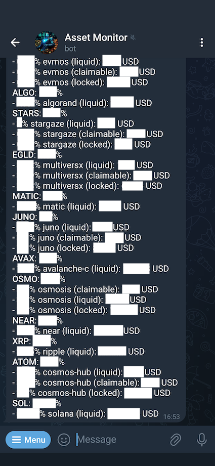

# Asset Monitor

## Description
A Node.js application that snapshots crypto assets every hour and stores them in a database. It also integrates Telegram bot as an interface to query summary of assets.

## Requirements
- Node.js v20.0.0+
- Postgres 14+

## Supported Chains / Exchanges
- Algorand
- Aptos
- Bitcoin & all Bitcoin-like chains (via Blockchair)
- Bybit (CEX)
- Cardano (via Blockfrost)
- Cosmos Hub & all Cosmos SDK chains
- Ethereum & all EVM chains
- Multiversx (formerly known as Elrond)
- Near
- Ripple
- Solana

## Installation
1. Install packages
	```bash
	npm install
	```
2. Create `env.yaml` file by cloning `env.template.yaml` and fill in the required fields.
	- `telegramBotToken`: Telegram Bot Token. Acquire token from @BotFather (https://core.telegram.org/bots/tutorial#obtain-your-bot-token).
	- `telegramChatId`: Chats to receive notifications. Acquire chat ID from @userinfobot (https://telegram.me/userinfobot).
	- `telegramWhitelistedChatIds`: Chats whitelisted to use the bot. Acquire chat ID from @userinfobot (https://telegram.me/userinfobot).
3. Create `knexfile.js` file by cloning `knexfile.template.js` and fill in database connection information.
4. Run migrations.
	```bash
	npx knex migrate:latest
	```
5. Run seeds.
	```bash
	npx knex seed:run
	```
6. Start the application.
	- with pm2:
		```bash
		npm run pm2:start
		```
	- without pm2:
		```bash
		npm start
		```

## Usage
### Create Asset Queries
Asset Queries tells the application which addresses to monitor. Currently they can only be created via SQL (under table `asset_queries`).
### Telegram Commands
Telegram provides a menu to list all available commands.



#### Command - /summary
Returns a summary of the latest snapshot batch.
For `Total Realized PnL` and `PnL%`, they are only accurate if asset flows are corr



#### Command - /asset-percentages
Returns the distribution and USD values of the assets in the latest snapshot batch.

